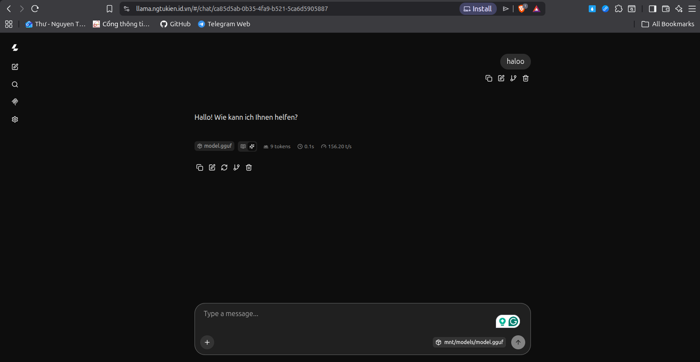

# Mini Lab: K8s (K3s), DRA & KServe cho AI Inference

## 1. Mô tả
Dự án này là một mini lab thực hành chuyên sâu nhằm kiểm chứng và ứng dụng các kiến thức về Container/GPU Orchestration. 

Mục tiêu cốt lõi của lab là giải quyết bài toán Resource Placement và Scaling cho AI Workload trong một môi trường bị giới hạn tài nguyên cục bộ trên laptop cá nhân (1 GPU 4GB VRAM). Lab sử dụng kiến trúc tối giản nhưng hiện đại:
* Hạ tầng: K3s (bản phân phối K8s nhẹ, phù hợp chạy local).
* Quản lý tài nguyên: Áp dụng tính năng Dynamic Resource Allocation (DRA) của Kubernetes để xin và chia sẻ tài nguyên linh hoạt, thay thế cho Device Plugin truyền thống.
* Model Serving: KServe cấu hình ở chế độ RawDeployment (loại bỏ các thành phần serverless như Knative/Istio) để tiết kiệm tối đa RAM hệ thống.

## 2. Setup
Hệ thống được thiết kế để chạy trực tiếp trên laptop cá nhân. Cấu hình phần cứng và phần mềm yêu cầu:
* CPU: >= 4 Cores.
* RAM hệ thống: >= 16GB (Quan trọng để tránh lỗi OOM khi load model weight).
* GPU: 1x NVIDIA GPU (4GB VRAM).
* OS: Ubuntu 22.04 LTS hoặc 24.04 LTS (Khuyên dùng Native Linux, hạn chế WSL2 để tránh lỗi mạng/driver).
* Công cụ: 
  - NVIDIA Container Toolkit & Drivers bản mới nhất.
  - kubectl, helm.
  - Cursor hoặc bất kỳ code editor nào để chỉnh sửa manifest.

## 3. Triển khai
Thực thi tuần tự các bước sau bằng command line tại local:

### Bước 1: Khởi tạo K3s & Kích hoạt DRA
* Cài đặt K3s cục bộ với flag kích hoạt tính năng: 
    ```bash
    curl -sfL https://get.k3s.io | sh -s - --kube-apiserver-arg=feature-gates=DynamicResourceAllocation=true
    ```
* Lấy kubeconfig từ `/etc/rancher/k3s/k3s.yaml` và export biến môi trường:
    ```bash
    # 0. Xóa biến config cũ
    unset KUBECONFIG
    # 1. Tạo thư mục .kube nếu chưa có
    mkdir -p ~/.kube
    # 2. Copy file cấu hình của K3s vào thư mục của bạn (cần sudo để copy file của root)
    sudo cp /etc/rancher/k3s/k3s.yaml ~/.kube/config
    # 3. Đổi quyền sở hữu file config vừa copy sang user của bạn
    sudo chown $(id -u):$(id -g) ~/.kube/config
    ```
* Kết quả: 
    ```bash
    ngtukien@NgTuKien:~/Documents/VDT_2026/15.Report$ kubectl get nodes
    NAME       STATUS   ROLES           AGE   VERSION
    ngtukien   Ready    control-plane   10m   v1.36.2+k3s1
    ngtukien@NgTuKien:~/Documents/VDT_2026/15.Report$ kubectl api-resources | grep resource.k8s.io
    deviceclasses                                    resource.k8s.io/v1                false        DeviceClass
    resourceclaims                                   resource.k8s.io/v1                true         ResourceClaim
    resourceclaimtemplates                           resource.k8s.io/v1                true         ResourceClaimTemplate
    resourceslices                                   resource.k8s.io/v1                false        ResourceSlice
    ```
### Bước 2: Cài đặt NVIDIA DRA Driver
* Cài đặt `helm`: 
    ```bash
    curl -fsSL https://raw.githubusercontent.com/helm/helm/main/scripts/get-helm-3 | bash
    ```
* Thêm kho lưu trữ chính thức của NVIDIA (Helm) và cập nhật:
    ```bash
    helm repo add nvidia https://helm.ngc.nvidia.com/nvidia
    helm repo update
    ```
* (Tùy chọn) Kiểm tra chart DRA Driver trên kho NVIDIA:
    ```bash
    helm search repo nvidia/nvidia-dra-driver-gpu
    ```
   **Kết quả:** 
    ```bash
    ngtukien@NgTuKien:~/Documents/VDT_2026/15.Report$ helm search repo nvidia/nvidia-dra-driver-gpu
    NAME                            CHART VERSION   APP VERSION     DESCRIPTION                                       
    nvidia/nvidia-dra-driver-gpu    25.12.0         25.12.0         Official Helm chart for the NVIDIA DRA Driver f...
    ```
* Dùng `helm` để triển khai DRA Driver. 
    ```bash
    helm install nvidia-dra nvidia/nvidia-dra-driver-gpu \
    --namespace nvidia-dra \
    --create-namespace \
    --set kubeletPlugin.cdiRoot=/var/run/cdi \
    --set gpuResourcesEnabledOverride=true
    ```
* Đánh nhãn node để K3s nhận diện GPU:
    ```bash
    kubectl label node <tên node> nvidia.com/gpu.present=true
    ```
* Kiểm tra node để xác nhận Driver đã tự động publish các ResourceSlice mô tả thuộc tính của GPU 4GB.
    ```bash
    ngtukien@NgTuKien:~/Documents/VDT_2026/15.Report$ kubectl get pods -n nvidia-dra
    NAME                                                READY   STATUS    RESTARTS   AGE
    nvidia-dra-driver-gpu-controller-6f867b6566-2qn77   1/1     Running   0          16m
    nvidia-dra-driver-gpu-kubelet-plugin-2tvnh          2/2     Running   0          11m
    ngtukien@NgTuKien:~/Documents/VDT_2026/15.Report$ kubectl get resourceslices
    NAME                                       NODE       DRIVER                      POOL       AGE
    ngtukien-compute-domain.nvidia.com-cwc7f   ngtukien   compute-domain.nvidia.com   ngtukien   11m
    ngtukien-gpu.nvidia.com-56wm7              ngtukien   gpu.nvidia.com              ngtukien   11m
    ngtukien@NgTuKien:~/Documents/VDT_2026/15.Report$ kubectl describe resourceslice ngtukien-compute-domain.nvidia.com-cwc7f
    Name:         ngtukien-compute-domain.nvidia.com-cwc7f
    Namespace:    
    Labels:       <none>
    Annotations:  <none>
    API Version:  resource.k8s.io/v1
    Kind:         ResourceSlice
    Metadata:
    Creation Timestamp:  2026-06-27T16:12:27Z
    Generate Name:       ngtukien-compute-domain.nvidia.com-
    Generation:          1
    Owner References:
        API Version:     v1
        Controller:      true
        Kind:            Node
        Name:            ngtukien
        UID:             a32f1fab-dde0-4022-96d1-a1b880b4d6a6
    Resource Version:  2499
    UID:               93d72b06-5708-4a0d-bf2c-be5876c45c48
    Spec:
    Devices:
        Attributes:
        Id:
            Int:  0
        Type:
            String:  daemon
        Name:        daemon-0
        Attributes:
        Id:
            Int:  0
        Type:
            String:  channel
        Name:        channel-0
    Driver:        compute-domain.nvidia.com
    Node Name:     ngtukien
    Pool:
        Generation:            1
        Name:                  ngtukien
        Resource Slice Count:  1
    Events:                    <none>
    ngtukien@NgTuKien:~/Documents/VDT_2026/15.Report$ kubectl describe resourceslice ngtukien-gpu.nvidia.com-56wm7 
    Name:         ngtukien-gpu.nvidia.com-56wm7
    Namespace:    
    Labels:       <none>
    Annotations:  <none>
    API Version:  resource.k8s.io/v1
    Kind:         ResourceSlice
    Metadata:
    Creation Timestamp:  2026-06-27T16:12:26Z
    Generate Name:       ngtukien-gpu.nvidia.com-
    Generation:          1
    Owner References:
        API Version:     v1
        Controller:      true
        Kind:            Node
        Name:            ngtukien
        UID:             a32f1fab-dde0-4022-96d1-a1b880b4d6a6
    Resource Version:  2497
    UID:               20f878c8-bc73-4a15-83ae-e65073905768
    Spec:
    Devices:
        Attributes:
        Addressing Mode:
            String:  None
        Architecture:
            String:  Ampere
        Brand:
            String:  GeForce
        Cuda Compute Capability:
            Version:  8.6.0
        Cuda Driver Version:
            Version:  13.0.0
        Driver Version:
            Version:  580.142.0
        Product Name:
            String:  NVIDIA GeForce RTX 3050 Laptop GPU
        resource.kubernetes.io/pciBusID:
            String:  0000:01:00.0
        resource.kubernetes.io/pcieRoot:
            String:  pci0000:00
        Type:
            String:  gpu
        Uuid:
            String:  GPU-0fed1b63-4733-e6e1-11d2-623625158ad2
        Capacity:
        Memory:
            Value:  4Gi
        Name:       gpu-0
    Driver:       gpu.nvidia.com
    Node Name:    ngtukien
    Pool:
        Generation:            1
        Name:                  ngtukien
        Resource Slice Count:  1
    Events:                    <none>
    ```
### Bước 3: Cấu hình KServe Minimal
* Thêm `cert-manager`:
    ```bash
    kubectl apply -f https://github.com/cert-manager/cert-manager/releases/download/v1.16.1/cert-manager.yaml
    ```
* Chỉ cài đặt KServe CRDs và Controller. 
    ```bash
    kubectl apply --server-side -f https://github.com/kserve/kserve/releases/download/v0.19.0/kserve.yaml
    ```
* Tùy chỉnh inferenceservice-config ConfigMap để thiết lập KServe chạy ở mode RawDeployment.
    ```bash
    kubectl patch configmap inferenceservice-config -n kserve --type=merge -p '{"data":{"deploy":"{\"defaultDeploymentMode\":\"RawDeployment\"}"}}'
    ```
* Kết quả:
    ```bash
    ngtukien@NgTuKien:~/Documents/VDT_2026/15.Report$ kubectl get pods -n kserve
    NAME                                                    READY   STATUS    RESTARTS   AGE
    kserve-controller-manager-8f5c5d979-665db               2/2     Running   0          2m45s
    kserve-localmodel-controller-manager-57cc7cb6db-vj4bb   1/1     Running   0          2m45s
    llmisvc-controller-manager-77cc4bc547-47tnq             1/1     Running   0          2m45s
    ```
### Bước 4: Cấp phát tài nguyên động
* Tạo [manifest](./manifest/01-dra/deviceclass.yaml) định nghĩa `DeviceClass` bằng biểu thức CEL để lựa chọn các thiết bị GPU do NVIDIA DRA Driver công bố.
    ```bash
    ngtukien@NgTuKien:~/Documents/VDT_2026/15.Report$ kubectl get deviceclasses
    NAME                                        AGE
    compute-domain-daemon.nvidia.com            80m
    compute-domain-default-channel.nvidia.com   80m
    gpu.nvidia.com                              80m
    mig.nvidia.com                              80m
    nvidia-gpu                                  68s
    vfio.gpu.nvidia.com                         80m
    ```
* Sử dụng `ResourceClaimTemplate` [manifest](./manifest/01-dra/resourceclaimtemplate.yaml) để Kubernetes tự động sinh ra các `ResourceClaim` xin cấp phát GPU cho từng Pod.
    ```bash
    ngtukien@NgTuKien:~/Documents/VDT_2026/15.Report$ kubectl get resourceclaimtemplates
    NAME           AGE
    gpu-template   8m54s
    ```
* (Tùy chọn) Khai báo [manifest](./manifest/01-dra/resourceclaim.yaml) định nghĩa `ResourceClaim` thủ công để xin cấp phát GPU từ `ResourceClaimTemplate` (Thực tế KServe sẽ tự động làm việc này thông qua InferenceService).
    ```bash
    ngtukien@NgTuKien:~/Documents/VDT_2026/15.Report$ kubectl get resourceclaims
    NAME           AGE
    gpu-claim      8m54s
    ```
### Bước 5: Deploy Model & Expose API
* Tạo [manifest](./manifest/02-storage/persistentvolume.yaml) định nghĩa `PersistentVolume` (hostPath) để mount trực tiếp thư mục chứa model trên ổ cứng laptop vào container.
    ```bash
    ngtukien@NgTuKien:~/Documents/VDT_2026/15.Report$ kubectl get pv
    NAME              CAPACITY   ACCESS MODES   RECLAIM POLICY   STATUS   CLAIM                  STORAGECLASS   VOLUMEATTRIBUTESCLASS   REASON   AGE
    llama-models-pv   5Gi        RWO            Retain           Bound    default/llama-models                  <unset> 
    ```
* Tạo [manifest](./manifest/02-storage/persistentvolumeclaim.yaml) định nghĩa `PersistentVolumeClaim` để xin cấp phát Storage (PV) vừa tạo.
    ```bash
    ngtukien@NgTuKien:~/Documents/VDT_2026/15.Report$ kubectl get pvc
    NAME           STATUS   VOLUME            CAPACITY   ACCESS MODES   STORAGECLASS   VOLUMEATTRIBUTESCLASS   AGE
    llama-models   Bound    llama-models-pv   5Gi        RWO                           <unset>                 34s
    ```
* Sử dụng container chứa model siêu nhẹ (vd: Qwen-1.5-0.5B-Chat GGUF).
    ```bash
    wget https://huggingface.co/QwenLM/Qwen-1.5-0.5B-Chat-GGUF/resolve/main/qwen1.5-0.5b-chat.Q4_K_M.gguf
    ```
* Tạo [manifest](./manifest/03-kserve/servingruntime.yaml) định nghĩa `ServingRuntime` để cấu hình runtime AI. `ServingRuntime` sử dụng image phục vụ suy luận (ví dụ: `llama.cpp`) và yêu cầu tài nguyên GPU thông qua danh sách resource claims.
    ```bash
    ngtukien@NgTuKien:~/Documents/VDT_2026/15.Report$ kubectl get servingruntime
    NAME                DISABLED   MODELTYPE   CONTAINERS         AGE
    llama-cpp-runtime              gguf        kserve-container   27m
    ```
* Tạo [manifest](./manifest/03-kserve/inferenceservice.yaml) định nghĩa `InferenceService` để triển khai mô hình AI. KServe InferenceService kết nối `ServingRuntime`, Model Storage và tự động sinh `ResourceClaim` từ `ResourceClaimTemplate` để lấy GPU.
    ```bash
    ngtukien@NgTuKien:~/Documents/VDT_2026/15.Report$ kubectl get inferenceservice
    NAME         URL                                     READY   PREV   LATEST   PREVROLLEDOUTREVISION   LATESTREADYREVISION   AGE
    llama-qwen   http://llama-qwen-default.example.com   True                                                                  27m
    ngtukien@NgTuKien:~/Documents/VDT_2026/15.Report$ kubectl get pods
    NAME                                    READY   STATUS    RESTARTS      AGE
    llama-qwen-predictor-57685c8575-h5bbx   1/1     Running   9 (14m ago)   30m27m
    ```
### Bước 6: Export API và Test
* Tạo [manifest](./manifest/04-network/cloudflare.yaml) cho pod Cloudflare tunnel để export API ra Internet (Lưu ý: cấu hình token bảo mật nằm trong file `./manifest/04-network/secret.yaml`).
    ```bash
    ngtukien@NgTuKien:~/Documents/VDT_2026/15.Report$ kubectl get pods
    NAME                                    READY   STATUS    RESTARTS      AGE
    cloudflared-845d7c844c-qj9zn            1/1     Running   0             4s
    llama-qwen-predictor-57685c8575-h5bbx   1/1     Running   9 (21m ago)   37m
    ngtukien@NgTuKien:~/Documents/VDT_2026/15.Report$ kubectl get svc -l serving.kserve.io/inferenceservice=llama-qwen
    NAME                   TYPE        CLUSTER-IP     EXTERNAL-IP   PORT(S)   AGE
    llama-qwen-predictor   ClusterIP   10.43.129.55   <none>        80/TCP    51m
    ```
* Cấu hình Cloudflare:
    * Service Type: `HTTP`
    * URL: `llama-qwen-predictor.default.svc.cluster.local:80`
* Kết quả:

* Kiểm tra tình trạng GPU hiện tại:
    ```bash
    ngtukien@NgTuKien:~/Documents/VDT_2026/15.Report$ nvidia-smi
    Sun Jun 28 09:58:59 2026       
    +-----------------------------------------------------------------------------------------+
    | NVIDIA-SMI 580.142                Driver Version: 580.142        CUDA Version: 13.0     |
    +-----------------------------------------+------------------------+----------------------+
    | GPU  Name                 Persistence-M | Bus-Id          Disp.A | Volatile Uncorr. ECC |
    | Fan  Temp   Perf          Pwr:Usage/Cap |           Memory-Usage | GPU-Util  Compute M. |
    |                                         |                        |               MIG M. |
    |=========================================+========================+======================|
    |   0  NVIDIA GeForce RTX 3050 ...    Off |   00000000:01:00.0 Off |                  N/A |
    | N/A   51C    P8              9W /   60W |    2757MiB /   4096MiB |      0%      Default |
    |                                         |                        |                  N/A |
    +-----------------------------------------+------------------------+----------------------+

    +-----------------------------------------------------------------------------------------+
    | Processes:                                                                              |
    |  GPU   GI   CI              PID   Type   Process name                        GPU Memory |
    |        ID   ID                                                               Usage      |
    |=========================================================================================|
    |    0   N/A  N/A            1671      G   /usr/lib/xorg/Xorg                        4MiB |
    |    0   N/A  N/A           53460      C   /app/llama-server                      2734MiB |
    +-----------------------------------------------------------------------------------------+
    ```
## 4. Nhận xét
* **Về tính năng DRA**: Dynamic Resource Allocation tách biệt hoàn toàn vòng đời của thiết bị (ResourceClaim) ra khỏi Pod, giúp việc cấp phát tài nguyên AI linh hoạt và chủ động hơn nhiều so với Node Affinity hay Taints/Tolerations.
* **Về tối ưu tài nguyên**: KServe RawDeployment kết hợp với K3s là chiến lược phù hợp nhất cho môi trường laptop có 4GB VRAM. Nó giải quyết được bài toán hao phí tài nguyên nền ("High CPU/memory usage") thường gặp khi triển khai hệ thống AI.
* **Tính ứng dụng**: Mặc dù được thiết kế chạy trên 1 node (laptop), mô hình này tuân thủ nguyên tắc "Application-Infrastructure Separation" và có thể áp dụng thẳng lên môi trường thực tế nhiều Node/GPU mà không cần thay đổi kiến trúc cốt lõi.